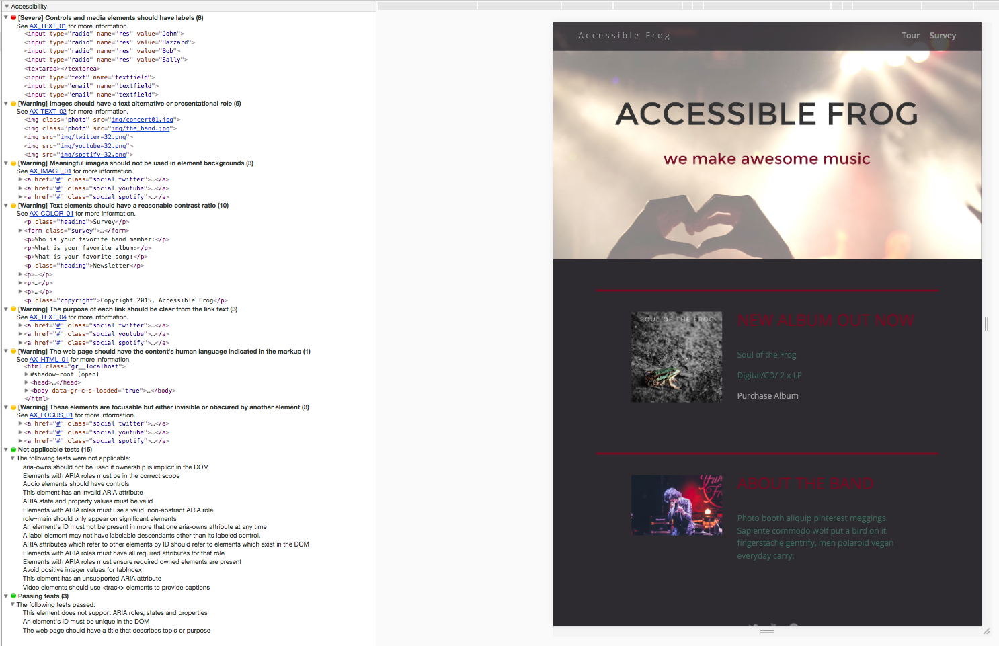
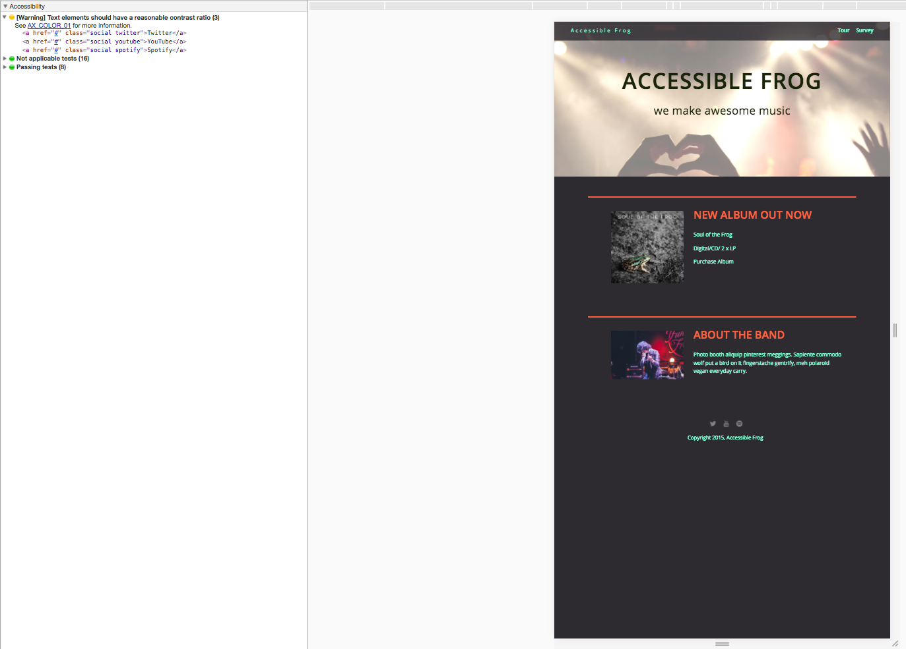

# TTH Front-End WeB Developer Techdegree - P08 - Accessibility Refactor

## Introduction

This is the eight of the TeamTreehouse Front-end Web Development Techdegree. The complete instruction of the project can be seen in [project_instructions.pdf](https://github.com/wahidyankf/treehouse-frontend-08-accessibility-refactor/blob/master/project_instructions.pdf), and the initial code and assets can be seen in the `initial_assets` folder.

## Usage

### Demo pages

You can see the demo page [here](https://wahidyankf.github.io/treehouse-frontend-08-accessibility-refactor/).

### Result

The result can be seen in the gh-pages branch of this repository.

### The Source

The source of this app can be seen in the src folder of master branch. 

## Testing

This app was tested using [HTML](https://validator.w3.org/) validator, [HTML-Accessibility](https://achecker.ca/checker/index.php) validator and [chrome accessibility tools](https://chrome.google.com/webstore/detail/accessibility-developer-t/fpkknkljclfencbdbgkenhalefipecmb?hl=en).

### Notes

I ignore the google chrome accessibility tools audit warnings of text-elements contrast and focusability, because the elements that being warned is the element that I intentionally hidden (transparent anchor text-element). Thus, it will not affect anybody that use it.

## Sreenshots

### Before Accessibility Refactor

### After Accessibility Refactor

## License

[MIT](https://en.wikipedia.org/wiki/MIT_License).